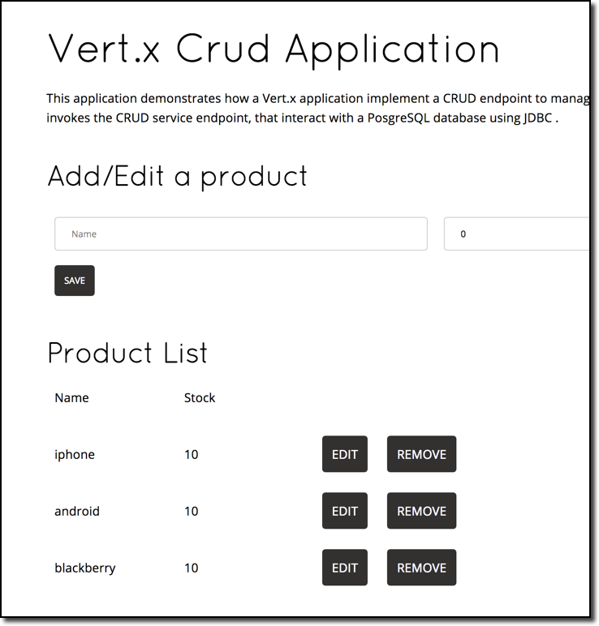

:scrollbar:
:data-uri:
:toc2:

= Red Hat OpenShift Application Runtimes - Vert.x CRUD Lab

This lab shows you how to implement a CRUD application using Vert.x.

This application demonstrates how a Vert.x application implement a CRUD endpoint to manage products. This management interface invokes the CRUD service endpoint, that interact with a PosgreSQL database using JDBC.

:numbered:

== Find lab6 project files

Each lab in this course is housed in separate directories. Using the command line, find and observe
the files for this lab:

    cd $HOME/vert.x/lab6

IMPORTANT: Be sure to replace `$HOME` with the directory you chose to put the content in previous labs.

== Open `lab6` using the IDE

* Use your favorite IDE and open the project files for lab6 (maven project). 

Once loaded, you should see the lab files and be able to navigate amongst the files. The components of this first project are laid out in different subdirectories according to Maven best practices:

* `pom.xml` - The Maven project file
* `src/main/java` - The source code to the project
* `src/main/resources` - The static resource files referenced in the code

== Review code for our verticles

The verticle, CrudApplication, exposes the RESTful endpoints for our application.

* In your IDE, open the file: `lab6/src/main/java/io.openshift.booster/CrudApplication.java`

** This code performs the following:

*** Creates a router object.
*** Performs validation of the :id parameter
*** Implements a basic REST CRUD mapping
*** Sets up a health check
*** Configures handlers for the web interface
*** Creates a JDBC client

* In your IDE, open the file: `lab6/src/main/java/io.openshift.booster/service/impl/JdbcProductStore.java`

** This code handles the database access for your application.

** Review the code for the CRUD database features

== Review code for Web Interface

This application uses AngularJS for a web interface. AngularJS is a JavaScript framework for creating single page applications. We use AngularJS in this project to submit AJAX calls to our REST endpoints. 

NOTE:
Full details of AngularJS is beyond the scope of this course.

* In your IDE, open the file: `lab6/src/main/webroot/index.html`

* This code renders a web view and provides button/handlers to call the REST endpoints.

== Review Maven POM file

. Review the `pom.xml` file, more specifically the configuration of the Fabric8 Vert.x plugin
* The `vert.x:package` goal is attached to the `package` maven goal
* The main verticle is set as a property `vertx.verticle` in the pom file.
. Build the application with maven. From the command line:
+
----
$ mvn clean package
----

== Login to OpenShift via the CLI

* If you are not logged into OpenShift, do so now:

-----
$ oc login ${YOUR-OPENSHIFT-SERVER} -u USER
-----

Replace `${YOUR-OPENSHIFT-SERVER}` with the server name for your training environment. Be sure to replace `USER` and `PASS` with your supplied credentials and accept any security exceptions (which is never
a good idea in a production scenario, but is fine for this lab).

You should get a `Login successful` message indicating you've successfully logged in.

== Create a new project

* Create a new project

-----
$ oc new-project crud-demo-userXX
-----

Be sure to replace `userXX` with your username.

== Build and Deploy service to OpenShift

It's time to build and deploy our service! To build and deploy:

-----
$ mvn clean fabric8:deploy -Popenshift
-----

* Check the status of your booster and ensure your pod is running.

----
$ oc get pods -w

NAME                            READY     STATUS      RESTARTS  AGE
crud-demo70-1-p2x5m     1/1       Running   0           17s
crud-demo70-1-deploy    0/1       Completed 0           22s
----

The crud-demo pod should have a status of Running once it is fully deployed and started. You should also wait for your pods to be ready before proceeding, which is shown in the READY column. For example, PROJECT_NAME-1-aaaaa is ready when the READY column is 1/1.

== Testing the application

* To exercise the application from outside of OpenShift, first discover the external hostname:

----
$ oc get routes

NAME               HOST/PORT                                                                     PATH      SERVICES           PORT      TERMINATION   WILDCARD
crud-vertx        crud-vertx-product-catalog-70.apps.41dc.openshift.opentlc.com                  crud-vertx        8080                    None
----

* In a web browser, open the URL for your application.

* You should see a list of products as shown below.

* Feel free to interact with your application.

* Congratulations, the lab is complete :-)
